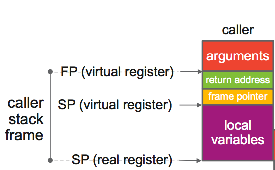

# plan9

- [閱讀前提](#閱讀前提)

- [變數](#變數)
  - [package](#package)
  - [作用範圍](#作用範圍)
  - [標誌](#標誌)
  - [int](#int)
  - [float](#float)
  - [bool](#bool)
  - [array](#array)
  - [string](#string)
  - [slice](#slice)
  - [map](#map)
  - [channel](#channel)
- [寄存器](#寄存器)
  - [SP](#SP)
  - [FP](#FP)
  - [PC](#PC)
  - [SB](#SB)
  - [範例](#範例)
- [函數](#函數)
- [參考](#參考)


## 閱讀前提

1. 對於組合語言(汇编语言)有基礎概念者才容易閱讀，可[參考](https://github.com/Junxwan/blog/tree/master/assembly)
2. 本章節內容有任何錯誤請儘管提出來，如果我有空則會回覆
3. 請動手做而不只是動眼睛
4. 本篇單純入門而已


## 變數

定義變數規則:`DATA symbol+offset(SB)/width, value`

```assembly
DATA ·Num+0(SB)/8,$0x4D2
```

宣告一個名叫`Num`變數，是一個64位元變數，初始值為`0x4D2`．另外要了解到plan9內定義的變數是沒有分類別，列如是int、string、map等等，在plan9眼裡就只是內存，所為的類別是golang所定義的，比如拿到一個64位元數字內存地址，golang就可以定義為int，拿到一組字串內存地址，golang就可以定義為string，相關類別在後續會提到，這邊只要知道plan9內沒有所謂的類別

| 欄位   | 定義                                    | 值    |
| ------ | --------------------------------------- | ----- |
| DATA   | 宣告做變數初始化                        |       |
| symbol | 變數名稱                                | ·Num  |
| offset | 從SB內存地址開始偏移多少個byte          | 0     |
| width  | 該變數使用多少byte，必須是1,2,4,8其一值 | 8     |
| value  | 變數值                                  | 0x4D2 |

以下是該變數示意內存結構，從內存結構可以得知`Num`變數從SB起始地址開始往後佔用8個byte

| 內存地址       | 值   |            |
| -------------- | ---- | ---------- |
| 0xffffffff0000 | 0xD2 | SB起始地址 |
| 0xffffffff0008 | 0x04 |            |
| 0xffffffff0010 | 0x00 |            |
| 0xffffffff0018 | 0x00 |            |
| 0xffffffff0020 | 0x00 |            |
| 0xffffffff0028 | 0x00 |            |
| 0xffffffff0030 | 0x00 |            |
| 0xffffffff0038 | 0x00 |            |

除了一次性設定初始值外也可以分批設定，針對每個byte做設定

```assembly
DATA ·Num+0(SB)/1,$0xD2
DATA ·Num+1(SB)/1,$0x04
DATA ·Num+2(SB)/1,$0x00
DATA ·Num+3(SB)/1,$0x00
DATA ·Num+4(SB)/1,$0x00
DATA ·Num+5(SB)/1,$0x00
DATA ·Num+6(SB)/1,$0x00
DATA ·Num+7(SB)/1,$0x00

```

其中value可以接受以下類型

| 類型         | 值        |
| ------------ | --------- |
| 十進位       | $1234     |
| 十六進位     | $0x04D2   |
| 浮點數       | $1234.56  |
| 字元         | $'1'      |
| 字串         | $"1234"   |
| 變數內存地址 | $·Num(SB) |

當設定完變數後如果想讓golang中也可以使用到則須定義成外部檔案也可以存取

定義變數規則: `GLOBL symbol(SB), width`

```assembly
DATA ·Num+0(SB)/8,$0x4D2
GLOBL ·Num(SB),$8
```

| 欄位   | 定義                                            | 值   |
| ------ | ----------------------------------------------- | ---- |
| GLOBL  | 外部可以存取                                    |      |
| symbol | 要開放外部的變數                                | ·Num |
| width  | 該變數佔用多少byte，必須是2的指數倍 2,4,8,16,32 | $8   |

以下兩段golang範例分別宣告一個`Num`全域int變數以及print `Num`變數而初始值是0

```go
// main.go
package main

import "test/test"

func main() {
	println(test.Num)
}
```

```go
// test/test.go
package test

var Num int
```

執行`main.go`可以看到 `Num`變數是0沒錯

```bash
/var/www # go run main.go 
0
```

這時候增加一個名叫`num_amd64.s`檔案，後綴詞`_amd64`是代表系統環境是`linux 64位元`，這樣執行時才會找到該檔案，另外注意最後一行要空一格不然會出現`asm: assembly of test/test_amd64.s failed`

```assembly
// num_amd64.s

DATA ·Num+0(SB)/8,$0x4D2
GLOBL ·Num(SB),$8

```

執行`main.go`可以看到 1234也就是`0x04d2`，初始值直接由plan9決定而非golang

```bash
/var/www # go run main.go 
1234
```


### package

symbol加上 `·` = `·symbol`的意思換成`·Num`其實代表當前package內的`Num`變數，當前的package就是test，所以`·Num`指的是goalng的`test.Num`變數

```go
println(test.Num) // ·Num = test.Num
```

將`test_amd64.s`改寫成

```assembly
// test/num_amd64.s

DATA Num+0(SB)/8,$0x4D2
GLOBL Num(SB),$8
```

可以看到`Num`初始值為0而不是1234，因為沒有`Num`變數前綴詞沒有加上`·`，證明需要變數前綴詞需加上`·`來對應到golang package

```bash
/var/www # go run main.go 
0
```


剛提到`·symbol`表示當前package內的變數，如果想要指定其他package該怎麼做呢？以下為實際範例

```go
// main.go
package main

import "test/test"

var Num int

func main() {
	println(Num)
	println(test.Num)
}
```

```go
// test/num.go
package test

var Num int
```

```assembly
// test/num_amd64.s
DATA main·Num+0(SB)/8,$0x4D2
GLOBL main·Num(SB),$8

```

從上述範例可以知道有兩個變數分別是`test.Num`與`main.Num`，在`test/num_amd64.s`上可以看到plan9表示的`main·Num`其實就是指golang的`main.Num`，以下為執行結果看看兩個golang變數值變化

```bash
/var/www # go run main.go 
1234 # main.Num
0 # test.Num
```


接下來探討利用plan9將某個變數值放到某變數上做初始化

```go
// main.go
package main

import (
	"test/test"
)

func main() {
	println(*test.Num)
}
```

```go
// test/test.go
package test

var Num *int
var Value = 4321
```

```assembly
// test/num_amd64.s

DATA ·Num+0(SB)/8,$·Value(SB)
GLOBL ·Num(SB),$8

```

上述先將`Num`變數改成指標，因為使用DATA標籤賦予變數初始值是放入該變數的內存地址，所以`Num`變數值其實是存放`Value`內存地址，執行後`Num`變數值就是4321

```bash
/var/www # go run main.go 
4321
```


### 作用範圍

在之前有提到GLOBL可以定義一個變數讓golang可以引用，但GLOBL其實還包含了plan9其他文件中使用也可以使用此變數，看下方範例，golang範例跟之前並無差異

```go
// main.go
package main

import (
	"test/test"
)

func main() {
	println(test.Num)
}
```

```go
// test/test.go
package test

var Num int
```

這裡`Num`變數值來自於`Value`變數內存地址

```assembly
// test/num_amd64.s
DATA ·Num+0(SB)/8,$Value(SB)
GLOBL ·Num(SB),$8

```

初始化`Value`變數，這邊可以看到`NOPTR`與`#include "textflag.h"`，這稍後章節在討論

```assembly
// test/value_amd64.s

#include "textflag.h"
DATA Value+0(SB)/8,$0x4d2
GLOBL Value(SB),NOPTR,$8

```

執行看看`Num`變數值為`17568096`，從這得知`num_amd64.s`可以看到`value_amd64.s`內的變數而`test.go`可以看到`num_amd64.s`的變數

```bash
/var/www # go run main.go 
17568096 # Value變數內存十六進位地址轉成十進位結果
```


Value`變數不在定義`GLOBL

```assembly
// test/value_amd64.s

DATA Value+0(SB)/8,$0x4d2

```

執行時`Num`變數告知找不到`Value`變數來參考，從這得出GLOBL不只是影響golang變數是否能參考到plan9的變數，是否plan9之間不同文件的變數也會互相影響到能見度呢？

```bash
/var/www # go run main.go 
# command-line-arguments
test/test.Num: relocation target Value not defined

```


這裡在做個實驗，將`value_amd64.s`變數移至`test/num_amd64.s`

```assembly
// test/value_amd64.s
// 清空
```

```assembly
// test/num_amd64.s
DATA Value+0(SB)/8,$0x4d2

DATA ·Num+0(SB)/8,$Value(SB)
GLOBL ·Num(SB),$8

```

執行後的結果也也一樣，代表GLOBL在plan9內變數能見度不分文件只看代碼

```bash
/var/www # go run main.go 
# command-line-arguments
test/test.Num: relocation target Value not defined
```


上述範例是`Value`變數並非是`·Value`，哪如果改成`·Value`會怎麼樣？

```assembly
// test/num_amd64.s
DATA ·Value+0(SB)/8,$0x4d2

DATA ·Num+0(SB)/8,$·Value(SB)
GLOBL ·Num(SB),$8

```

結果也是一樣，只是這次`Num`變數想要參考的是`test/test.Value`而非是plan9內定義的`Value`變數

```bash
/var/www # go run main.go 
# command-line-arguments
test/test.Num: relocation target test/test.Value not defined

```


如果golang增加一個`Value`變數

```go
// test/test.go
package test

var Num *int // 由於plan9內賦予的初始值是Value的內存地址，所以把Num變成指標
var Value int
```

```go
// main.go
package main

import (
	"test/test"
)

func main() {
	println(*test.Num) // Num變數是指標，加上*取變數值
}
```

執行後的結果不是`1234(0x4d2)`而是0，這代表`DATA ·Num+0(SB)/8,$·Value(SB)`，內的`Value`是參考golang中的`Value`變數而非plan9的`Value`變數

```bash
/var/www # go run main.go 
0
```

如果將`·Value`多定義一個GLOBL則golang `Value`變數會先參考到plan9的`Value`變數，之後`Num`變數被賦予golang `Value`變數內存地址時就會得到`1234(0x4d2)`的結果

```assembly
// test/num_amd64.s
DATA ·Value+0(SB)/8,$0x4d2

DATA ·Num+0(SB)/8,$·Value(SB)
GLOBL ·Num(SB),$8
```

```bash
/var/www # go run main.go 
1234
```

因此得出下列結論

1. main.go設定全域變數是否能參考到plan9定義的變數呢？
2. DATA ·Num+0(SB),[Value]，中DATA對於`Value`變數的能見度呢？

| 文件/代碼       | GLOBL Num | GLOBL Value | GLOBL ·Num | GLOBL ·Value | Num    | Value  | ·Num   | ·Value |
| --------------- | --------- | ----------- | ---------- | ------------ | ------ | ------ | ------ | ------ |
| main.go         | 不可見    | 不可見      | 可見       | 可見         | 不可見 | 不可見 | 不可見 | 不可見 |
| DATA ·Num+0(SB) |           | 可見        |            | 可見         |        | 不可見 |        | 不可見 |

總結

1. golang想要引用到plan9中定義的變數，plan9內變數需以`·symbol`方式定義且加上GLOBL
2. plan9內變數之間要互相使用需定義成GLOBL


剛剛驗證定義GLOBL的變數能見度，現在來看`<>`這個符號，當一個變數加上此符號時則代表此變數只作用在當下文件中

```assembly
DATA ·Num<>+0(SB)/8,$0x4d2
GLOBL ·Num<>(SB),$8
```

實際範例

```go
// main.go
package main

import (
	"test/test"
)

func main() {
	println(*test.Num)
}
```

```go
// test/test.go
package test

var Num *int
```

```assembly
// test/num_amd64.s

DATA ·Num+0(SB)/8,$Value<>(SB)
GLOBL ·Num(SB),$8

```

```assembly
// test/value_amd64.s

#include "textflag.h"
DATA Value<>+0(SB)/8,$0x4d2
GLOBL Value<>(SB),NOPTR,$8

```

執行結果是`Num`變數無法參考到plan9 定義的`Value`變數

```bash
/var/www # go run main.go 
# command-line-arguments
test/test.Num: relocation target Value not defined
```

現在改個方式，將`test/value_amd64.s`內容搬到`test/num_amd64.s`

```assembly
#include "textflag.h"

DATA Value<>+0(SB)/8,$0x4d2
GLOBL Value<>(SB),NOPTR,$8

DATA ·Num+0(SB)/8,$Value<>(SB)
GLOBL ·Num(SB),$8

```

執行結果`Num`變數是`1234 (0x4d2)`，可以看出來`<>`是限制該變數只作用在當下文件內

```bash
/var/www # go run main.go 
1234
```


注意當使用plan9定義的變數值想要讓golang變數做參考時，golang變數值不能初始化完成，以下實際範例

```go
// main.go
package main

import (
	"test/test"
)

func main() {
	println(test.Num)
}
```

```go
// test/test.go
package test

var Num = 1
```

```assembly
// test/num_amd64.s

DATA ·Num+0(SB)/8,$0x4D2
GLOBL ·Num(SB),$8
```

執行結果是失敗，所以當要交由plan9設定變數值時，golang變數只能宣告不能初始化，不然會產生下方錯誤

```bash
/var/www # go run main.go 
# command-line-arguments
2019/12/10 06:17:59 duplicate symbol test/test.Num (types 30 and 32) in test/test and $WORK/b002/_pkg_.a(test_amd64.o)
```


### 標誌


### int

golang宣告int相關變數並由plan9初始化

```go
// main.go
package main

import (
	"test/test"
)

func main() {
	println(test.Int)
	println(test.Int8)
	println(test.Int16)
	println(test.Int32)
	println(test.Int64)
	println("========")
	println(test.Uint)
	println(test.Uint8)
	println(test.Uint16)
	println(test.Uint32)
	println(test.Uint64)
}
```

```go
// test/num.go
package test

var Int int
var Int8 int8
var Int16 int16
var Int32 int32
var Int64 int64

var Uint uint
var Uint8 uint8
var Uint16 uint16
var Uint32 uint32
var Uint64 uint64
```

不同位元的int需要佔用不同的內存空間

```assembly
// test/num_amd64.go
DATA ·Int(SB)/8,$1<<63 -1
GLOBL ·Int(SB),$8

DATA ·Int8(SB)/1,$1<<7-1
GLOBL ·Int8(SB),$1

DATA ·Int16(SB)/2,$1<<15-1
GLOBL ·Int16(SB),$2

DATA ·Int32(SB)/4,$1<<31-1
GLOBL ·Int32(SB),$4

DATA ·Int64(SB)/8,$1<<63-1
GLOBL ·Int64(SB),$8

DATA ·Uint(SB)/8,$1<<64-1
GLOBL ·Uint(SB),$8

DATA ·Uint8(SB)/1,$1<<8-1
GLOBL ·Uint8(SB),$1

DATA ·Uint16(SB)/2,$1<<16-1
GLOBL ·Uint16(SB),$2

DATA ·Uint32(SB)/4,$1<<32-1
GLOBL ·Uint32(SB),$4

DATA ·Uint64(SB)/8,$1<<64-1
GLOBL ·Uint64(SB),$8

```

執行結果

```bash
/var/www # go run main.go 
9223372036854775807 # int
127 # int8 
32767 # int16
2147483647 # int32
9223372036854775807 # int64
========
18446744073709551615 #uint 
255 # uint8
65535 # uint16
4294967295 # uint32
18446744073709551615 # uint64
```


### float

golang宣告float相關變數並由plan9初始化

```go
// main.go
package main

import (
	"test/test"
)

func main() {
	println(test.Float32)
	println(test.Float64)
}
```

```go
// test/num.go
package test

var Float32 float32
var Float64 float64
```

不同位元的float需要佔用不同的內存空間

```assembly
// test/num_amd64.s
DATA ·Float32(SB)/4,$3.40282346638528859811704183484516925440e+38
GLOBL ·Float32(SB),$4

DATA ·Float64(SB)/8,$1.797693134862315708145274237317043567981e+308
GLOBL ·Float64(SB),$8

```

執行結果

```bash
/var/www # go run main.go 
+3.402823e+038 # Float32
+1.797693e+308 # Float64
```


### bool

golang宣告`True`與`False`兩個bool變數並由plan9初始化

```go
// main.go
package main

import (
	"test/test"
)

func main() {
	println(test.True)
	println(test.False)
}
```

```go
// test/test.go
package test

var True bool
var False bool
```

```assembly
// test/bool_amd64.s
DATA ·True(SB)/1,$1
GLOBL ·True(SB),$1

DATA ·False(SB)/1,$0
GLOBL ·False(SB),$1

```

執行後的結果

```bash
/var/www # go run main.go 
true
false
```


### array

golang宣告`Name`變數為[2]int並由plan9初始化

```go
// main.go
package main

import (
	"test/test"
)

func main() {
	println(test.Num[0])
	println(test.Num[1])
}
```

```go
// test/test.go
package test

var Num [2]int
```

```assembly
// test/num_amd64.s
DATA ·Num+0(SB)/8,$0x4d2
DATA ·Num+8(SB)/8,$0x4d3
GLOBL ·Num(SB),$16
```

執行後的結果是

```bash
/var/www # go run main.go 
1234
1235
```


### string

string其實是一種struct，包含了原始的string資料以及長度，比較特別是string本身資料其實是`uintptr`型態也就是指標，該指標指向某個內存地址，該地址才是真正儲存string資料的地方．

```go
// reflect/value.go
type StringHeader struct {
	Data uintptr
	Len  int
}
```

遇到像是上述這種結構該如何以plan9去表達，以下為實際範例

```go
// main.go
package main

import (
	"reflect"
	"test/test"
	"unsafe"
)

func main() {
	println(test.String)
	
  // 將string結構轉成reflect.StringHeader
	hdr := (*reflect.StringHeader)(unsafe.Pointer(&test.String))
	println(hdr.Data)
	println(hdr.Len)
}
```

```go
// test/string.go
package test

var String string
```

`DATA ·String+0(SB)/8,$data(SB)`代表將`data`變數內存地址賦予`String`變數，`DATA  ·String+8(SB)/8,$6`表示該`String`變數長度為4

```assembly
#include "textflag.h"

DATA  data(SB)/8,$"test"
GLOBL data(SB),NOPTR,$8

DATA  ·String+0(SB)/8,$data(SB)
DATA  ·String+8(SB)/8,$4 # 內容長度4
GLOBL ·String(SB),$16  

```

| plan9                           | StringHeader欄位 | 類型    |
| ------------------------------- | ---------------- | ------- |
| DATA  ·String+0(SB)/8,$data(SB) | Data             | uintptr |
| DATA  ·String+8(SB)/8,$4        | Len              | int     |

執行結果為"test"

```bash
/var/www # go run main.go 
test # string值
5329120 # string內存地址(十進位)
4 # len
```

透過plan9對照golang struct格式分配內存就可以讓該struct從plan9參考到資料，也就是說plan9本身不認識任何golang中的類型或是struct，只是分配的內存能對應到golang所需要的內存結構，golang就能自行判斷是哪種類型或是struct


### slice

slice結構跟string結構很類似，只是多一個`Cap`欄位

```go
type reflect.SliceHeader struct {
    Data uintptr
    Len  int
    Cap  int
}
```

以plan9方式定義slice

```go
// main.go
package main

import (
	"fmt"
	"reflect"
	"test/test"
	"unsafe"
)

func main() {
	fmt.Printf("%s \n", test.String)

	hdr := (*reflect.SliceHeader)(unsafe.Pointer(&test.String))
	println(hdr.Data)
	println(hdr.Len)
	println(hdr.Cap)
}
```

```go
// test/slice.go
package test

var String []byte
```

```assembly
// test/slice_amd64.s

#include "textflag.h"

DATA  data+0(SB)/8,$"Hello "
DATA  data+8(SB)/8,$"World"
GLOBL data(SB),NOPTR,$16

DATA  ·String+0(SB)/8,$data(SB)
DATA  ·String+8(SB)/8,$13 #內容長度13
DATA  ·String+16(SB)/8,$16 
GLOBL ·String(SB),$24
```

執行結果

```bash
/var/www # go run main.go 
Hello World # 內容
5555504 # 內容內存地址(十進位)
13 # len
16 # 總佔用多少byte
```


### map


### channel


## 寄存器

plan9內的寄存器跟一般組合語言的寄存器不太一樣，下列是amd64與plan9寄存器對應關係，從表格可以看出來plan9少了amd64中表示寄存器是多少位元的前綴詞

| amd64 | rax  | rbx  | rcx  | rdx  | rdi  | rsi  | rbp  | rsp  | rip  | r8 ~ r14 |
| ----- | ---- | ---- | ---- | ---- | ---- | ---- | ---- | ---- | ---- | -------- |
| plan9 | AX   | BX   | CX   | DX   | DI   | SI   | BP   | SP   | PC   | R8 ~ R14 |

除了上述這些寄存器，plan9還引入四個偽寄存器

| 寄存器 | 使用方式          | 說明             |
| ------ | ----------------- | ---------------- |
| FP     | symbol+offset(FP) | 操作參數與返回值 |
| PC     | 無特別格式        | 同rip            |
| SB     | symbol+offset(SB) | 全局內存訪問     |
| SP     | symbol+offset(SP) | 同rsp            |

以下圖來說明SP與FP關係



> 圖片來源自 [Go functions in assembly language](https://github.com/golang/go/files/447163/GoFunctionsInAssembly.pdf)

這四個寄存器定義可以參考[官網](https://golang.org/doc/asm#symbols)

### SP

sp在plan9中有分成兩種，一種是真的sp等同rsp，一種是偽裝成rsp可以理解為rbp，如果不懂rbp是做什麼可以參考[stack](https://github.com/Junxwan/blog/tree/master/assembly#stack)實例．

真實的sp會隨著stack操作而異動如上圖一直指向stack frame底部，而偽sp則是會固定在某一個位置，不隨著stack操作而有異動，因為這個特性偽sp通常拿來操作局部變數．

但是plan9上只有一個SP要如何分辨何種情況是真何種是偽，首先操作的格式為`symbol+offset(SP)`，當無symbol時真SP，有symbol則是偽SP

| a－8(SP) | 偽SP |
| -------- | ---- |
| 8(SP)    | 真SP |

SP當中的`symbol`，本質上沒有什麼功能只是當作一個變數的識別，通常會以參數或變數名稱命名．

真SP都在低位址，所以訪問變數時以正數會當偏移量(往上找)，偽SP在高地址訪問變數時以負赴數會當偏移量(往下找)，可參考上方示意圖


### FP

主要操作function參數與返回值，依照上方示意圖來看FP在偽SP之上，兩者間隔`parent return
address與`frame pointer`數據，前者代表著該function執行完成後要返回的內存地址，後者個人認為是存放偽SP資料，詳情參考[stack](https://github.com/Junxwan/blog/tree/master/assembly#stack)實例．

示意圖可以看出FP之上的`argumentsd`，這部分就是function參數與返回值，透過正數偏移量即可操作

```assembly
movq a+0(FP), AX // AX = a
movq b+8(FP), BX // BX = b
```


### PC

簡單來說就是rip的簡稱，功能都一樣


### SB

主要是全局內存訪問，如果有看過[介紹plan9變數](#變數)，可以了解到定義一個變數使用`DATA`做宣告變數名後方都會寫`(SB)`，就是從SB這個內存地址開始分配內存，同樣在介紹[函數](#函數)章節也會用到此寄存器為函數分配內存

```assembly
DATA  num+0(SB)/8,$0x4d2 

TEXT ·Add(SB), $0-16
```

依照上述範例可以這樣理解，假設SB代表一個內存分配器

1. 跟SB告知說要申請一個8 byte空間的內存，地址從SB內存地址加0x0偏移量，並把這塊內存命名為num
2. 跟SB告知說要申請一個16 byte空間的內存，地址由SB自動分配，並把這塊內存命名為Add
3. 上述兩種動作對SB來講都只是分配一塊內存而已，沒有區分成變數或是函數，只是我們為了方便理解而定義某內存做什麼用途，以plan9角度來看就只是內存


### 範例

看了上述解釋可能還不太了解，用一個範例來講解這四個寄存器應用


## 函數


## 參考

[plan9 assembly 完全解析]([https://github.com/cch123/golang-notes/blob/master/assembly.md#plan9-assembly-%E5%AE%8C%E5%85%A8%E8%A7%A3%E6%9E%90](https://github.com/cch123/golang-notes/blob/master/assembly.md#plan9-assembly-完全解析))

[Go Assembly 示例](https://colobu.com/goasm/)

[Go语言高级编程](https://chai2010.cn/advanced-go-programming-book/ch3-asm/readme.html)

[A Quick Guide to Go's Assembler](https://golang.org/doc/asm#architectures)

[golang plan9 指令清單](https://golang.org/src/cmd/internal/obj/x86/anames.go)

[Go functions in assembly language](https://github.com/golang/go/files/447163/GoFunctionsInAssembly.pdf)