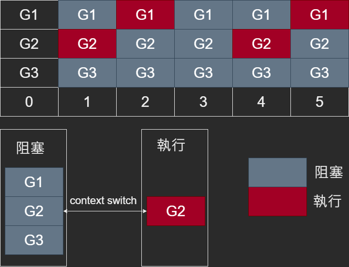
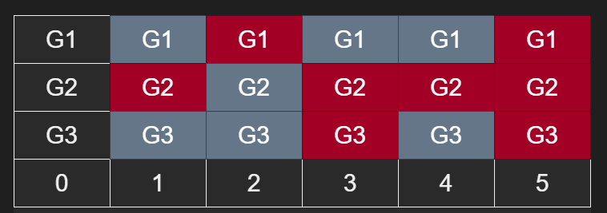

# 互斥鎖

# 自旋鎖

# Lock Free
正常的鎖假設是互斥鎖如下以golang做示範

```golang
import (
	"fmt"
	"sync"
)

func main() {
	a := 0
	num := 3
	wait := new(sync.WaitGroup)
	wait.Add(num)
	lock := new(sync.Mutex)

	for i := 0; i < num; i++ {
		go func() {
			for i := 0; i < 10000; i++ {
				lock.Lock()
				a += 1
				lock.Unlock()
			}

			wait.Done()
		}()
	}

	wait.Wait()

	fmt.Print(a) // 30000
}
```
大致步驟如下
1. `a`初始值為0
2. 啟動三個goroutine分別for 1萬次 a+=1
3. 每次a+=1前先上互斥鎖，a+=1完後再解開互斥鎖
4. 三個goroutine for都跑完1萬次後將a印出來
5. 答案就是1萬+1萬+1萬，所以a值是3萬，永遠不會變

把三個goroutine分別假設是G1/G2/G3，同時針對`a`做寫入動作時有加鎖會讓另外兩個goroutine進入block狀態避免出現race condition，所以當G1操作`a`時會lock
讓G2/G3會進入block狀態，當G1 unlock時，G2/G3才有機會去操作`a`並lock讓其中兩個goroutine再進入block狀態，然後每次從block狀態下要喚醒
去執行任務時，中間狀態切換也就是context switch會是一個較大開銷，不論是在block狀態下喚醒還是因為contention導致必須block中間狀態切換都會
context switch，而Lock Free相比則是少了switch context的開銷也就是不使用lock來避免race condition與deadlock，只依靠atomic跟一些算法來實現lock功能



Lock Free的定義是無論執行多久應用程式中至少都要保持有一個或以上線程是處於Make Progress

> Make Progress是指正在處理某種任務

如上圖在3時可以看到G2/G3狀態是block，假設G1已經處理完當下任務並unlock把狀態切換成block，然而G2/G3在block狀態下來不及喚醒，導致G1/G2/G3可能
同時都處在block狀態下形成沒有任何一個線程是處於Make Progress，這種情況就不符合Lock Free定義

如下圖無論執行多久應用程式中至少都要保持有一個或以上線程是處於Make Progress才符合Lock Free



Lock Free雖然無mutex額外開銷看似效率會比有mutex更好，但存在很多缺點比如ABA/Memory Barrier等問題，而且
Lock Free還必須自己實現一套算法，如果越是複雜則效能可不比mutex好，畢竟每次算完失敗可是要重來的，
所以Lock Free真正的優點在於能避免deadlock/live lock以及當你算法很簡單無複雜邏輯時才能展現出比mutex好，
不然一律都使用mutex遇到有效能問題再考慮

## Critical Section(臨界區)

程序想要使用共享资源，必然通过一些指令去访问这些资源，若多个任务都访问同一资源，那么访问该资源的指令代码组成的区域称临界区。简而言之，临界区是代码

涉及读写竟态资源的代码片段叫“临界区”。

## 範例
Lock Free比較常用在queue這種結構上

> TODO 要準備golang範例

## CAS(Compare-And-Swap)

它的功能是判断内存某个位置的值是否为预期值。如果是则更改为新的值，这个过程是原子的

CAS是compareAndSwap，比较当前工作内存中的值和主物理内存中的值，如果相同则执行规定操作，否者继续比较直到主内存和工作内存的值一致为止

CAS不加锁，保证一次性，但是需要多次比较

循环时间长，开销大（因为执行的是do while，如果比较不成功一直在循环，最差的情况，就是某个线程一直取到的值和预期值都不一样，这样就会无限循环）

只能保证一个共享变量的原子操作

但是对于多个共享变量操作时，循环CAS就无法保证操作的原子性，这个时候只能用锁来保证原子性

CAS是一条CPU的原子指令，不会造成所谓的数据不一致的问题，也就是说CAS是线程安全的

CAS是Compare And Swap的缩写，直译就是比较并交换。CAS是现代CPU广泛支持的一种对内存中的共享数据
进行操作的一种特殊指令，这个指令会对内存中的共享数据做原子的读写操作。其作用是让CPU比较内存中某个
值是否和预期的值相同，如果相同则将这个值更新为新值，不相同则不做更新。


## ABA

## Memory Barrier

# Wait Free

# 參考
## Lock
1. [你说说互斥锁、自旋锁、读写锁、悲观锁、乐观锁的应用场景](https://www.cnblogs.com/xiaolincoding/p/13675202.html)
2. [Linux 自旋锁，互斥量（互斥锁），读写锁](https://blog.51cto.com/u_15060511/4336949)

## Lock Free
1. [对wait-free和lock-free的理解](https://zhuanlan.zhihu.com/p/342921323)
2. [多线程编程的时候，使用无锁结构会不会比有锁结构更加快？
](https://www.zhihu.com/question/53303879)
3. [简化概念下的 lock-free 编程](https://zhuanlan.zhihu.com/p/53012280)
4. [Lock-Free 编程](https://www.cnblogs.com/gaochundong/p/lock_free_programming.html)

## Critical Section(臨界區)
1. [互斥锁，同步锁，临界区，互斥量，信号量，自旋锁之间联系是什么？](https://www.zhihu.com/question/39850927)
2. [[多线程] 临界区Critical Section、互斥锁Mutex / 读写锁Read/Write Lock、事件Evetn、条件变量Condition_variable和信号量Semphore](https://blog.51cto.com/u_15338624/3583817)
3. [Go精妙的互斥锁设计](https://mp.weixin.qq.com/s/tpasNf81z9W_BBjxFZyNJw#at)

## CAS
1. [Compare And Swap的底层原理](https://www.yisu.com/zixun/317995.html)
2. [聊聊高并发中的 CAS（compare and swap）](https://zhuanlan.zhihu.com/p/438406660)
3. [什么是CAS？如果说不清楚，这篇文章要读一读](https://zhuanlan.zhihu.com/p/544803708)
4. [CAS有什么缺点吗？](https://www.zhihu.com/question/276774701/answer/2711447651)
5. [什么是CAS？如果说不清楚，这篇文章要读一读](https://zhuanlan.zhihu.com/p/544803708)
